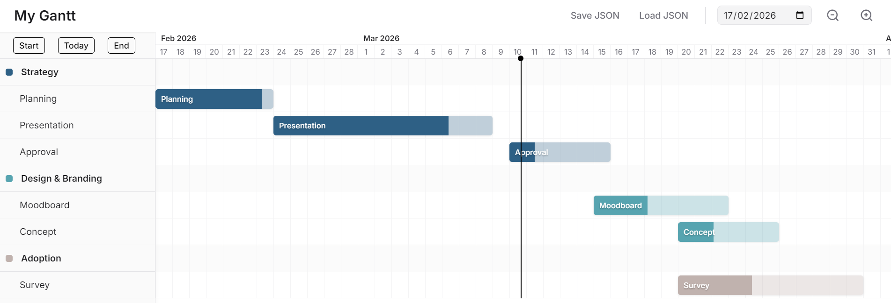

# Simple Gantt
A simple Gantt chart application for rapid planning without the need of extensive parametrization based on Vue.
All tasks can be positioned and re-sized via drag-and-drop.



## Core Features
- Auto-adjusting scalable time-scale
- Drag-and-drop mechanics
- Task progress slider
- Add/Remove/Edit groups & tasks
- Save and load the current state

## Demo
<video controls="controls" src="https://github.com/user-attachments/assets/8b341513-088e-4fec-a1d6-7dd550ec932b"></video>

## Usage
```bash
cd ../gantt
npm run dev
```
